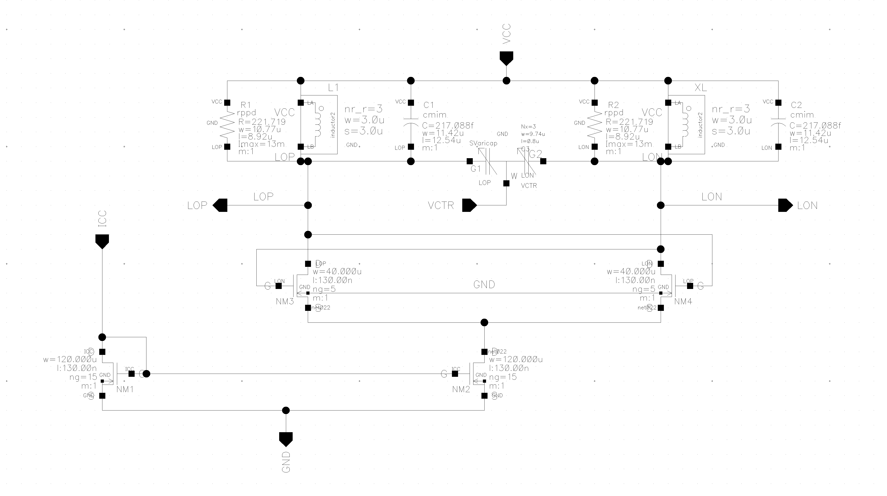
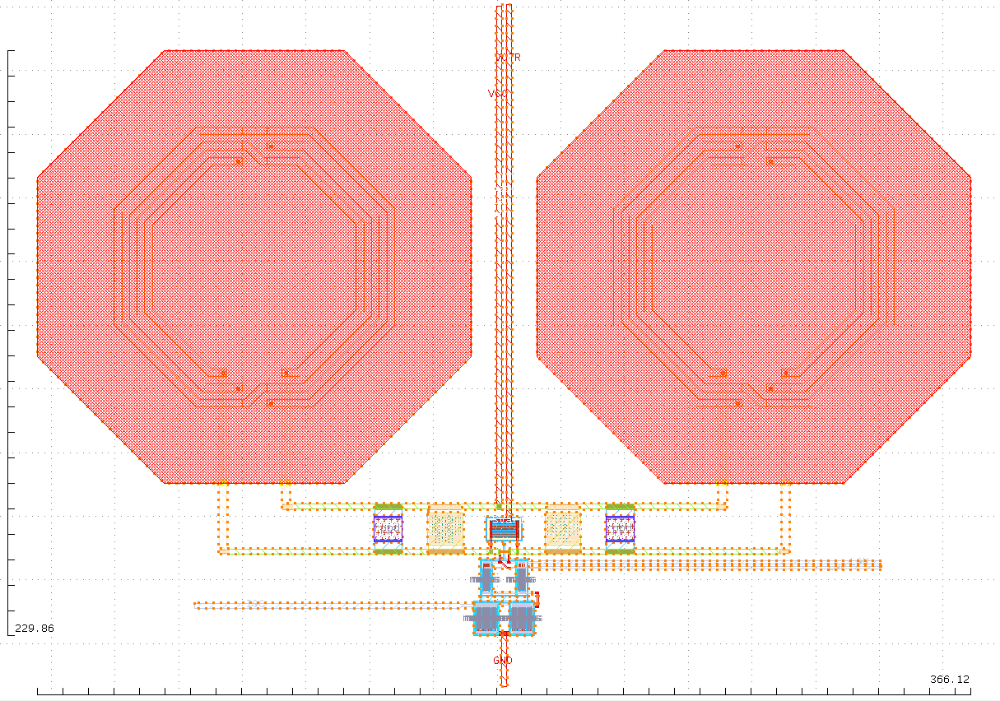
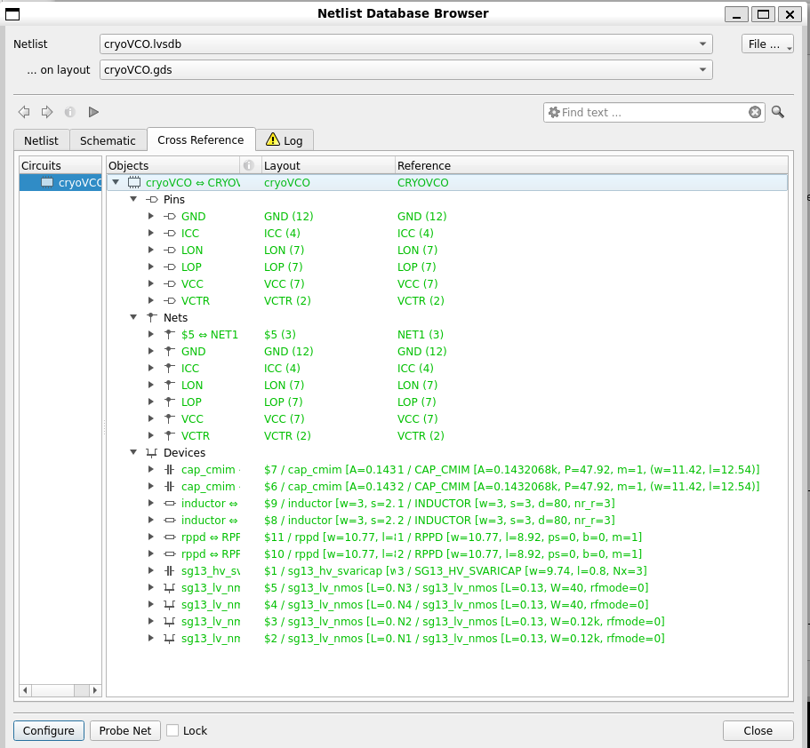

# Voltage-Controlled Oscillator (VCO)
The LC-VCO schematic was implemented in the Cadence Virtuoso environment, using the technology available in the SG13G2 folder for room-temperature simulations. To enable operation under cryogenic conditions, transistor characterization was provided by IHP and made available in the SG13G2C folder, allowing for the analysis of device behavior at low temperatures. The schematic and the testbench were implemented according to Figures 1 and 2, respectively.

   
  <em>Figure 1: LC-VCO schematic.</em>

   
  <em>Figure 2: Testbench setup for the LC-VCO.</em>

## Specifications

| Component  | Value                  |
| ---------- | ---------------------- |
| M1, M2     | W/L = 120 μm / 0.13 μm |
| M3, M4     | W/L = 40 μm / 0.13 μm  |
| C1, C2     | 217.1 fF               |
| C3         | W/L = 9.74 μm / 0.8 μm |
| R1, R2     | 221.72 Ω               |
| L1, L2     | 1.54 nH                |

## Input and Output of a Cross-Coupled LC-VCO:

- LOP and LON: Differential output pair
- VCC: Power supply terminal
- ICC: Bias current terminal
- VCTR: Control Voltage of the varactor
- GND: Ground terminal

## Parameters

| Parameter               | Value   (300 K)     | Value   (4 K)        |
| ----------------------- | ------------------- | -------------------- |
| Technology              | IHP (SG13G2) 130 nm | IHP (SG13G2C) 130 nm |
| Control Voltage (Vctrl) | 0–3 V               | 0–3 V                |
| Supply Voltage          | 1.2 V               | 1.2 V                | 
| Bias Current            | 6 mA                | 6 mA                 |

## Layout

Below is the final completed layout of the designed circuit.

   
  <em>Figure 3: LC-VCO Layout.</em>

## Post-Layout Simulation

   
  <em>Figure 4: Simulated oscillation frequency versus control voltage.</em>

   
  <em>Figure 5: Simulated phase noise at 4.9 GHz.</em>

| Parameter            | Value (300 K) | Value (4 K) |
| -------------------- | ------------- | ----------- |
| Operating Frequency  | 4.9 GHz       | 4.9 GHz     |
| Tuning Range         | 4.7–5.0 GHz   | 4.8–5.1 GHz |
| Phase Noise (@1 MHz) | -98.8 dBc/Hz  | -110 dBc/Hz |

## DRC and LVS Verification

The layout verification was performed using KLayout to ensure the design satisfies all design rule checks (DRC) and layout-versus-schematic (LVS) requirements.

- DRC verification: The Design Rule Check (DRC) verifies that the layout follows all the design rules defined by the PDK.

   
  <em>Figure 6: Layout complies with design rules.</em>

- LVS verification: The Layout Versus Schematic (LVS) verification confirms that the implemented layout matches the original schematic design.

   
  <em>Figure 7: Layout matches original schematic.</em>

